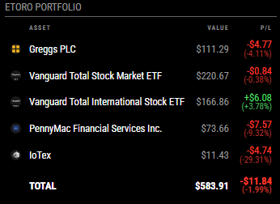

# MMM-eToro

[](https://github.com/MagicMirrorOrg/MagicMirror)


A MagicMirror² module to display your eToro portfolio summary, including total equity, current profit/loss, and percentage gains in real-time.



## Features
* **Individual Asset Tracking:** Shows each stock, ETF, or crypto in your portfolio.
* **Smart Aggregation:** Automatically groups multiple open positions of the same asset into a single row.
* **Automated Metadata:** Dynamically fetches asset names and high-quality SVG logos from the eToro Market API.
* **Profit/Loss Monitoring:** Real-time tracking of net profit with color-coded (Green/Red) status.
* **Clean Aesthetic:** Designed to match the native MagicMirror² UI using subtle typography and circular icons.

## Prerequisites
1.  An eToro account.
2.  An eToro API Key and User Key. 
    * Note: These can be generated under Settings > Trading > API Key Management.

## Installation

1.  Navigate to your MagicMirror modules directory:
    cd ~/MagicMirror/modules

2.  Clone this repository:
    git clone https://github.com/owensy/MMM-eToro.git

3.  Enter the module directory and install dependencies:
    cd MMM-eToro
    npm install

## Configuration

Add the following to the modules array in your config/config.js file:

```javascript
{
    module: "MMM-eToro",
    position: "top_right",
    config: {
        apiKey: "YOUR_ETORO_API_KEY",
        userKey: "YOUR_ETORO_USER_KEY",
        demo: false,
        updateInterval: 600000
    }
},
```

## Configuration Options

| Option | Default | Description |
| :--- | :--- | :--- |
| `apiKey` | `None` | **Required.** Your eToro Public API Key. |
| `userKey` | `None` | **Required.** Your eToro User Key. Make sure this matches your `demo` setting. |
| `demo` | `false` | Set to `true` if you are using your Virtual Portfolio/Demo account keys. |
| `updateInterval` | `600000` | How often to fetch data (in ms). Default is 10 minutes (600,000ms). |

## CSS Styling
Customize the look by editing MMM-eToro.css. It uses standard MagicMirror classes for a native look.

## Credits
Data provided by eToro Public API

## Disclaimer
This module is for informational purposes only. Use it at your own risk. The developer is not responsible for any financial decisions made based on the data displayed.

## License
MIT
